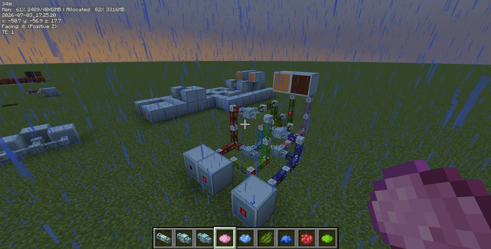

# [TG] Turing Game

## Languages

- [English](README_EN-US.md)
- [中文](README.md)

## This is a mod that provides logic gates

Well, what else is there to say?  
Makes one ponder…

## Features

What do we offer?
1. Logic gates
2. Cable signals
3. undefiled

## Environment

1.21 fabric

## Links
- [Repository](https://github.com/good-player-dao3/Turing-Game/)
- [Tutorial – Getting Started](https://www.bilibili.com/video/BV1GJ411x7h7/)
- [Tutorial – Example 1](https://www.bilibili.com/video/BV1GJ411x7h7/)
- [Tutorial – Example 2](https://www.bilibili.com/video/BV1GJ411x7h7/)